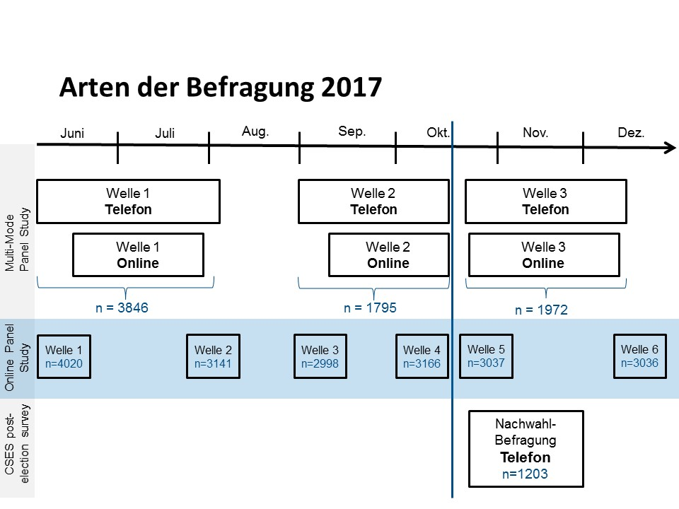

```{r setup, include=FALSE, warning=FALSE, message=FALSE}
knitr::opts_chunk$set(echo = TRUE)


## Setting the working directory
setwd(githubdir)
setwd("autnes_visualizations")

## This loads the required packages, if they are not installed it also installs them
if (!require("pacman")) install.packages("pacman")
pacman::p_load(tidyverse, readstata13, ggalluvial, naniar, visdat)


## Load the data sets
## df_multi is the three wave multi-mode panel. Waves 1-2 were conducted before the election
## and wave 3 was after the election. Each wave was doneon the phone and online. 
## df_online is the six wave online panel. Waves 1-4 are pre-election panel waves,
## waves 5-6 are post-election panel waves.
## more information available on panel structure here:
## https://autnes.at/en/autnes-data/general-election-2017

df_online <- read.dta13("data/10017_da_en_v2_0.dta", convert.factors = FALSE)


check1 <-
  df_online %>% 
  filter(w1_panelist == 1) %>% 
  dplyr::select(id, starts_with("w1_"), -c(w1_panelist:w1_dte)) %>% 
  mutate_if(is.factor, list(~na_if(., "refused"))) %>% 
  mutate_if(is.character, list(~na_if(., "refused"))) %>% 
  mutate_if(is.character, list(~na_if(., ""))) %>% 
  mutate_if(is.numeric, list(~na_if(., 99))) 


check2 <-
  df_online %>% 
  filter(w2_panelist == 1) %>% 
  dplyr::select(id, starts_with("w2_"), -c(w2_panelist:w2_dte)) %>% 
  mutate_if(is.factor, list(~na_if(., "refused"))) %>% 
  mutate_if(is.character, list(~na_if(., "refused"))) %>% 
  mutate_if(is.character, list(~na_if(., ""))) %>% 
  mutate_if(is.numeric, list(~na_if(., 99))) 

check3 <-
  df_online %>% 
  filter(w3_panelist == 1) %>% 
  dplyr::select(id, starts_with("w3_"), -c(w3_panelist:w3_dte)) %>% 
  mutate_if(is.factor, list(~na_if(., "refused"))) %>% 
  mutate_if(is.character, list(~na_if(., "refused"))) %>% 
  mutate_if(is.character, list(~na_if(., ""))) %>% 
  mutate_if(is.numeric, list(~na_if(., 99))) 


check4 <-
  df_online %>% 
  filter(w4_panelist == 1) %>% 
  dplyr::select(id, starts_with("w4_"), -c(w4_panelist:w4_dte)) %>% 
  mutate_if(is.factor, list(~na_if(., "refused"))) %>% 
  mutate_if(is.character, list(~na_if(., "refused"))) %>% 
  mutate_if(is.character, list(~na_if(., ""))) %>% 
  mutate_if(is.numeric, list(~na_if(., 99))) 


check5 <-
  df_online %>% 
  filter(w5_panelist == 1) %>% 
  dplyr::select(id, starts_with("w5_"), -c(w5_panelist:w5_dte)) %>% 
  mutate_if(is.factor, list(~na_if(., "refused"))) %>% 
  mutate_if(is.character, list(~na_if(., "refused"))) %>% 
  mutate_if(is.character, list(~na_if(., ""))) %>% 
  mutate_if(is.numeric, list(~na_if(., 99))) 


check6 <-
  df_online %>% 
  filter(w6_panelist == 1) %>% 
  dplyr::select(id, starts_with("w6_"), -c(w6_panelist:w6_dte)) %>% 
  mutate_if(is.factor, list(~na_if(., "refused"))) %>% 
  mutate_if(is.character, list(~na_if(., "refused"))) %>% 
  mutate_if(is.character, list(~na_if(., ""))) %>% 
  mutate_if(is.numeric, list(~na_if(., 99))) 


```

# Examining Missing Data 

This R Markdown document examines the missigness patterns in the AUTNES 2017 Online Panel data that occur due to survey attrition and survey nonresponse.




\pagebreak

# Missigness due to survey attrition

## Attrition by individuals that did not take the first wave

The first plot shows survey participation of individuals that missed the first wave. 1's indicate survey wave participation and 0's absence from the survey wave. 


```{r, echo=FALSE, warning=FALSE, message=FALSE}
df_online %>% 
  dplyr::select(w1_panelist, w2_panelist, w3_panelist, 
                w4_panelist, w5_panelist, w6_panelist) %>% 
  group_by(w1_panelist, w2_panelist, w3_panelist, 
           w4_panelist, w5_panelist, w6_panelist) %>% 
  mutate_at(c(1:6), as.factor) %>% 
  add_tally(name = "freq") %>% 
  ungroup() %>% unique %>% 
  unite(type, c(w1_panelist, w2_panelist, w3_panelist, 
                w4_panelist, w5_panelist, w6_panelist), sep = ",", remove = FALSE) %>% 
  filter(w1_panelist == 0) %>% 
  ggplot(aes(y = freq,
           axis1 = w1_panelist, axis2 = w2_panelist, axis3 = w3_panelist,
           axis4 = w4_panelist, axis5 = w5_panelist, axis6 = w6_panelist)) +
  geom_alluvium(aes(fill = type),
                width = 0, knot.pos = 0, reverse = FALSE) +
  guides(fill = FALSE) +
  geom_stratum(width = 1/8, reverse = FALSE) +
  geom_text(stat = "stratum", aes(label = after_stat(stratum)),
            reverse = FALSE) +
  scale_x_continuous(breaks = 1:6, labels = c("W1", "W2", "W3", "W4", "W5", "W6")) +
  coord_flip() +
  labs(title = "Online Survey - Participation by individuals missing 1st wave",
       y = "Frequency", x = "Wave") + theme_minimal()
```

\pagebreak 

## Attrition by individuals that took the first wave

The second plot shows survey participation of individuals that did not missed the first wave. 1's indicate survey wave participation and 0's absence from the survey wave.

Colors indicate outcome categories for participating in/missing each of the six waves. Since there are $2^6$ combinations possible \texttt{ggplot} defaults to a continuous coloring scheme. This is not perfect but the main point is visualized. Steady attrition of the initial participants, following wave three a surprising stable core group of panelists as well as substantial switching between participation and missing.  

```{r, echo=FALSE, warning=FALSE, message=FALSE}
df_online %>% 
  dplyr::select(w1_panelist, w2_panelist, w3_panelist, 
                w4_panelist, w5_panelist, w6_panelist) %>% 
  group_by(w1_panelist, w2_panelist, w3_panelist, 
           w4_panelist, w5_panelist, w6_panelist) %>% 
  mutate_at(c(1:6), as.factor) %>% 
  add_tally(name = "freq") %>% 
  ungroup() %>% unique %>% 
  unite(type, c(w1_panelist, w2_panelist, w3_panelist, 
                w4_panelist, w5_panelist, w6_panelist), sep = ",", remove = FALSE) %>% 
  filter(w1_panelist == 1) %>% 
  ggplot(aes(y = freq,
             axis1 = w1_panelist, axis2 = w2_panelist, axis3 = w3_panelist,
             axis4 = w4_panelist, axis5 = w5_panelist, axis6 = w6_panelist)) +
  geom_alluvium(aes(fill = type),
                width = 0, knot.pos = 0, reverse = FALSE) +
  guides(fill = FALSE) +
  geom_stratum(width = 1/8, reverse = FALSE) +
  geom_text(stat = "stratum", aes(label = after_stat(stratum)),
            reverse = FALSE) +
  scale_x_continuous(breaks = 1:6, labels = c("W1", "W2", "W3", "W4", "W5", "W6")) +
  coord_flip() +
  labs(title = "Online Survey - Participation by individuals taking 1st wave",
       y = "Frequency", x = "Wave") + theme_minimal()       
```

# Missigness due to Nonresponse

In the following six figures the missing data patterns ("refused" or "99") are visualized. Large clusters of NA over multiple variables and almost all respondents in the data are due to conditional questions in the survey, skip logic, and question design (e.g., "Which of these 15 issues is the most important issue for you?", where each issue becomes a binary column in the data set). 

Smaller and lighter clusters of nonresponse are actual nonresponse of survey respondents. Here survey respondents were not forced to answer or were given the option to refuse in addition to indicate "Don't know".

```{r, echo=FALSE, warning=FALSE, message=FALSE}
vis_miss(check1) + labs(title = "NA Patterns in Wave 1")
#vis_dat(check1) + labs(title = "NA Patterns in Wave 1")

```
```{r, echo=FALSE, warning=FALSE, message=FALSE}
vis_miss(check2) + labs(title = "NA Patterns in Wave 2")
#vis_dat(check2) + labs(title = "NA Patterns in Wave 2")

```
```{r, echo=FALSE, warning=FALSE, message=FALSE}
vis_miss(check3) + labs(title = "NA Patterns in Wave 3")
#vis_dat(check3) + labs(title = "NA Patterns in Wave 3")
```
```{r, echo=FALSE, warning=FALSE, message=FALSE}
vis_miss(check4, warn_large_data = FALSE) + labs(title = "NA Patterns in Wave 4")
#vis_dat(check4, warn_large_data = FALSE) + labs(title = "NA Patterns in Wave 4")

```
```{r, echo=FALSE, warning=FALSE, message=FALSE}
vis_miss(check5) + labs(title = "NA Patterns in Wave 5")
#vis_dat(check5) + labs(title = "NA Patterns in Wave 5")
```
```{r, echo=FALSE, warning=FALSE, message=FALSE}
vis_miss(check6) + labs(title = "NA Patterns in Wave 6")
#vis_dat(check6) + labs(title = "NA Patterns in Wave 6")

```
